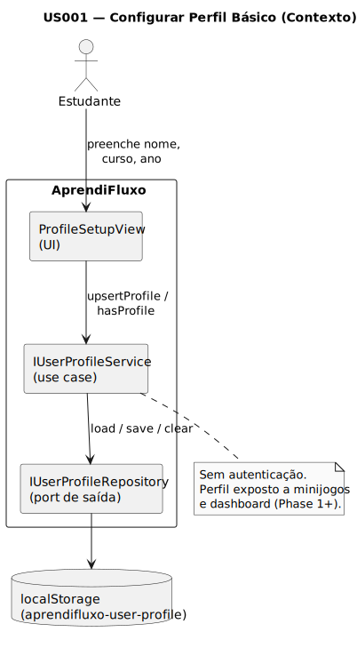

# US001 - Configurar Perfil Básico

**Épico:** Configuração Inicial  
**Phase:** Phase 1 — MVP  
**Prioridade:** Alta  
**Status:** Pendente

## Resumo

Como estudante, quero configurar o meu perfil básico (nome, curso, ano) para que o AprendiFluxo personalize a experiência de aprendizagem.

## Objetivo

- Recolher nome, curso e ano lectivo do utilizador na primeira utilização.
- Persistir o perfil localmente (localStorage) sem autenticação.
- Expor o perfil via port `IUserProfileRepository` para uso nos minijogos e no dashboard.

## Diagramas

### Contexto



Fonte: [`diagrams/context.puml`](./diagrams/context.puml) · Regenerar SVG: ver secção abaixo.

---

## Links Rápidos

- [Requirements](./01-requirements/requirements.md)
- [Domain](./02-domain/)
- [Ports](./03-ports/)
- [Adapters](./04-adapters/)
- [Contracts](./05-contracts/interfaces.ts)
- [Implementation Notes](./implementation-notes.md)
- [Diagramas (PlantUML)](./diagrams/)

---

## Regenerar SVG

Na pasta `diagrams/`:

```bash
plantuml -tsvg -Smonochrome=true -SbackgroundColor=FFFFFF -Sshadowing=false -SpackageStyle=rectangle -o ../svg *.puml
```

Sem `plantuml` no PATH (Windows):

```powershell
cd docs\system-documentation\US001\diagrams
java -jar ..\..\..\..\tools\plantuml\plantuml.jar -tsvg -Smonochrome=true -SbackgroundColor=FFFFFF -Sshadowing=false -SpackageStyle=rectangle -o ..\svg *.puml
```

## Ver também

- [Roadmap](../roadmap.md)
- [Glossário](../glossary.md)

## Status

- **Estado no código**: Parcial.
