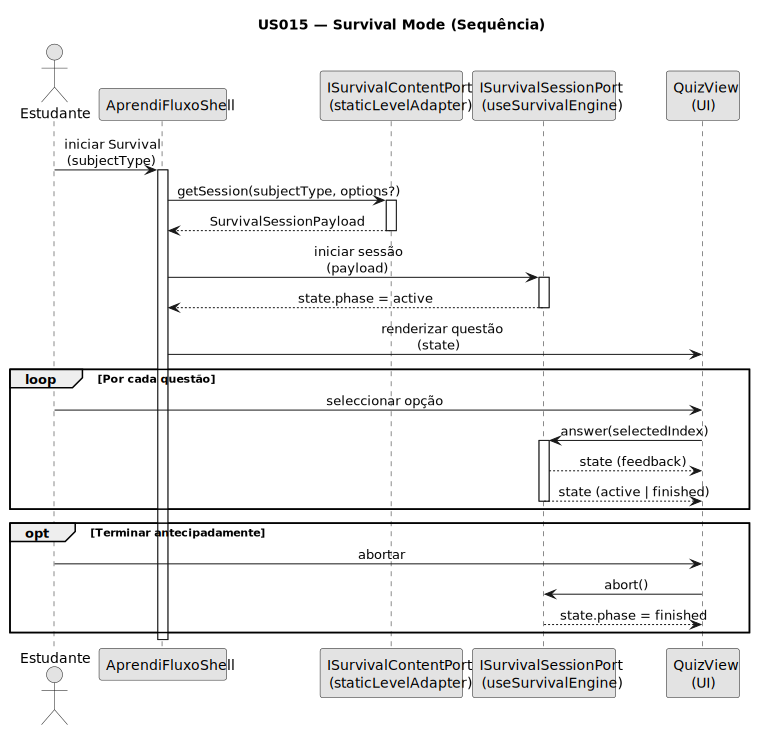

# US015 - Survival Mode (Exame Simulado)

**Épico:** Motor de Minijogos  
**Phase:** Phase 1 — MVP  
**Prioridade:** Alta  
**Status:** Em Progresso

## Resumo

Survival Mode é o simulador de exame do AprendiFluxo. Consome um `SurvivalSessionPayload` (futuro RAG) e corre um motor (`useSurvivalEngine`) agnóstico à fonte de dados.

## Objetivo

- Garantir um **contrato estável** (`SurvivalSessionPayload`) para payload gerado por pipeline RAG.
- Isolar UI de dados estáticos (`data/`) via adaptador.
- Preparar regra adaptativa (US013): **errar → bloquear progresso → minijogo corretivo**.

## Diagramas

### Sequência (Survival Mode)



Fonte: [`diagrams/sequence.puml`](./diagrams/sequence.puml) · Regenerar SVG: ver secção abaixo.

---

## Links Rápidos

- [Requirements](./01-requirements/requirements.md)
- [Domain](./02-domain/)
- [Ports](./03-ports/)
- [Adapters](./04-adapters/)
- [Contracts](./05-contracts/interfaces.ts)
- [Implementation Notes](./implementation-notes.md)
- [Diagramas (PlantUML)](./diagrams/)

---

## Regenerar SVG

Na pasta `diagrams/`:

```bash
plantuml -tsvg -Smonochrome=true -SbackgroundColor=FFFFFF -Sshadowing=false -SpackageStyle=rectangle -o ../svg *.puml
```

Sem `plantuml` no PATH (Windows):

```powershell
cd docs\system-documentation\US015\diagrams
java -jar ..\..\..\..\tools\plantuml\plantuml.jar -tsvg -Smonochrome=true -SbackgroundColor=FFFFFF -Sshadowing=false -SpackageStyle=rectangle -o ..\svg *.puml
```

## Referências (código atual)

- Contrato: `src/ports/survival/contracts.ts`
- Motor: `src/adapters/frontend/hooks/useSurvivalEngine.js`
- Shell: `src/adapters/frontend/shell/AprendiFluxoShell.jsx`
- UI (sessão): `src/adapters/frontend/components/views/QuizView.jsx`
- UI (conclusão): `src/adapters/frontend/components/views/CompletionView.jsx`
- Timer (tempo/restante): `src/adapters/frontend/hooks/useTimer.js` + `src/adapters/frontend/shell/AprendiFluxoShell.jsx` (cálculo `displayTime`)

## Status

- **Estado no código**: Implementado.
